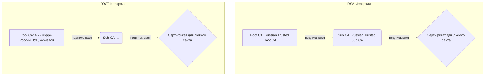
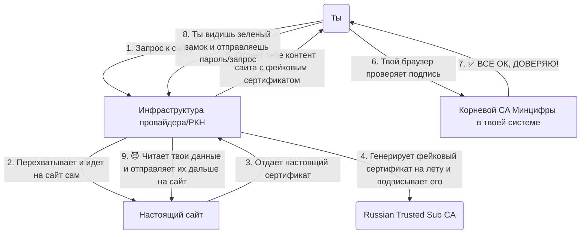

# 🕵️ Расследование: Что за сертификаты Минцифры

Это первая часть моего расследования о так называемых "сертификатах безопасности" от Минцифры. Цель: собрать полное досье, понять почему это - потенциально опасно!


## Этап 1: Добыча улик

С самого начала я наткнулся на очевидную проблему: нельзя просто так взять и скопировать ссылку на скачивание сертификата. Кнопка "Копировать ссылку" отсутствует.


Поэтому я набросал простой скрипт для Tampermonkey, чтобы перехватить запрос на скачивание.

> Скрипт можно найти в репозитории: `[./scripts/getlink.user.js](https://raw.githubusercontent.com/zarazaex69/m1ncertrazvedka/master/scripts/getlink.user.js)`

После запуска скрипт показал, что кнопка не ведет на файл напрямую, а вызывает код из вот этого JavaScript-файла:


Ссылка вела на `https://gu-st.ru/landings-st/main.4978f1b2316e002d.js`.

## 🍩 Этап 2: Деобфускация

Содержание этого JS-файла, как и ожидалось, было грустным. Сплошная обфускация — весь код в одну строку.


Но и не такое проходили. Покопавшись в коде, я нашел то, что искал — прямые ссылки на архивы с сертификатами:
- `https://gu-st.ru/content/lending/linux_russian_trusted_root_ca_pem.zip`
- `https://gu-st.ru/content/lending/russian_trusted_sub_ca_pem.zip`

> **Примечание:** Эти ==ссылки могут со временем умереть==. Для автоматизации поиска можно использовать скрипт ==(который позже тоже может умереть)== `[./scripts/deob.go](https://raw.githubusercontent.com/zarazaex69/m1ncertrazvedka/master/scripts/deob.go)`. Но все нужные файлы уже лежат в этом репозитории в папке `[./certs](https://raw.githubusercontent.com/zarazaex69/m1ncertrazvedka/master/certs)`.

Скачиваем файлы с помощью `wget`:

```bash
# Скачиваем корневые сертификаты
wget "https://gu-st.ru/content/lending/linux_russian_trusted_root_ca_pem.zip"

# Скачиваем выпускающие (промежуточные) сертификаты
wget "https://gu-st.ru/content/lending/russian_trusted_sub_ca_pem.zip"
```


Как видно выше, файлы успешно скачались. Осталось их распаковать.

> **Для тех, кто читает это на GitHub:** Вам ничего делать не надо, все файлы уже скачаны и распакованы в репозитории.

```bash
unzip "*.zip"
```


Улики на месте. Переходим к допросу.

## 🍪 Этап 3: Допрос фигурантов

> **! ДИСКЛЕЙМЕР !**
>
> ДАЛЬШЕ ИДУТ ЗАУМНЫЕ ШТУКИ. ЕСЛИ ТВОЙ МОЗГ РАЗМЕРОМ С ОРЕХ, МОЖЕШЬ НЕ ПОНЯТЬ.

Начнем с главного фигуранта — корневого сертификата `russian_trusted_root_ca_pem.crt`.

Нам нужно получить ответы на три ключевых вопроса:
- **"Кто ты такой?"** (`Subject`) — кому выдан сертификат.
- **"Кто за тебя поручился?"** (`Issuer`) — кем он подписан.
- **"На что ты имеешь право?"** (`Extensions`) — что ему разрешено делать.

Для этого мы используем `openssl` — мясо для работы с криптографией.

```bash
# Допрашиваем корневой RSA сертификат
openssl x509 -in russian_trusted_root_ca_pem.crt -text -noout

# Допрашиваем корневой ГОСТ сертификат
openssl x509 -in russian_trusted_root_ca_gost_2025_pem.crt -text -noout

# Допрашиваем промежуточный RSA сертификат
openssl x509 -in russian_trusted_sub_ca_pem.crt -text -noout
```

Вывод команды выглядит страшно, особенно для ебаного питониста вроде тебя:


Но если разобраться, все становится ясно. Полные протоколы допроса на момент написания статьи лежат здесь:
- `[./certs/interrogation/root_rsa.txt](https://raw.githubusercontent.com/zarazaex69/m1ncertrazvedka/master/certs/interrogation/root_rsa.txt)`
- `[./certs/interrogation/sub_rsa.txt](https://raw.githubusercontent.com/zarazaex69/m1ncertrazvedka/master/certs/interrogation/sub_rsa.txt)`
- `[./certs/interrogation/root_gost.txt](https://raw.githubusercontent.com/zarazaex69/m1ncertrazvedka/master/certs/interrogation/root_gost.txt)`
- `[./certs/interrogation/sub_gost.txt](https://raw.githubusercontent.com/zarazaex69/m1ncertrazvedka/master/certs/interrogation/sub_gost.txt)`

## 🍿 Этап 4: Промежуточные выводы и структура

Анализ показал, что мы имеем дело с двумя полноценными иерархиями сертификатов (RSA и ГОСТ). Обе являются технически корректными Центрами Сертификации (CA) и обладают полномочиями выпускать сертификаты для любых сайтов.

Вот как выглядит цепочка доверия:



Установка этих корневых сертификатов в систему означает полное доверие их владельцу. Это дает владельцу возможность для проведения MitM-атак, и ваш браузер даже не пикнет.


## 🕵️ Расследование: Что они могут !

Итак, мы вскрыли сертификаты и поняли, что они из себя представляют. Теперь главный вопрос: **что они, блядь, могут?**

Если коротко: **читать твой HTTPS трафик. Весь. С любого устройства, где он установлен.**

Представь ситуацию. Роскомнадзор хочет узнать, на что ты дрочил вчера в два часа ночи. Обычно HTTPS — твой лучший друг. Он шифрует все между тобой и сайтом, и провайдер видит только бессмысленную кашу из байтов.

С установленным сертификатом Минцифры этот "лучший друг" превращается в крысу.

###  1 🫘: MitM - атака, ставшая государственной "фичей"

Без этого сертификата, если кто-то попытается влезть в твой трафик, браузер заорет как резаный и покажет огромную красную ошибку CONNECTION_NOT_PRIVATE. **НИКОГДА НЕ ПРОДОЛЖАЙ, ЕСЛИ ВИДИШЬ ЭТО.** Это работа браузера — защищать тебя от самозванцев.

И самое страшное: им даже не нужно тебя "взламывать" с помощью[ ARP-spoofing'](https://habr.com/ru/articles/786038/)а. **Они уже контролируют твой интернет-канал.** Они УЖЕ человек посередине. Этот сертификат — просто ключ, который позволяет им расшифровать трафик, который и так идет через них.

Вот как это работает:



Как видишь, для тебя все выглядит легитимно. Но посередине сидит тот, кто контролирует сеть, и читает абсолютно все: логины, пароли, переписки, номера карт и историю просмотров.

### 2 🥃: Кто эти "они"? Векторы атаки

- **Интернет-провайдеры и ркн:** Самый очевидный кандидат. У них уже стоит оборудование СОРМ для "анализа" трафика. Этот сертификат — просто ключ, который позволяет им открыть последнюю дверь с надписью "HTTPS".


###  0 🥫: Отдельный прикол: Криптография ГОСТ

С RSA-сертификатами все понятно: мы не доверяем *владельцу* сертификата. С ГОСТ-сертификатами добавляется еще один уровень паранойи: **мы не можем до конца доверять *самой криптографии***.

> Международные алгоритмы (RSA, AES) — это как замок, чертежи которого изучали и пытались взломать лучшие слесари со всего мира на протяжении десятилетий.
>
> ГОСТ — это замок, который сделал один государственный завод. Чертежи есть только у него, и он клянется, что мастер-ключ есть только у него. Верить ему или нет — твой выбор.

Мы не можем доказать наличие бэкдора в ГОСТе, но отсутствие тоже.
## 🕵️ Расследование: Наглое вранье

Как я и говорил в первом посте в своем тгк ([советую к прочтению и подписке](https://t.me/zarazaexdev/96)), они нам нагло пиздят. Давайте разберем их официальные тезисы с сайта Госуслуг.

### 1. Тейк 🧀: "Без нас вы не защищены!"


**Их слова:** *"Без сертификатов ваши личные данные недостаточно защищены, поэтому при попытке зайти на сайт появится предупреждение о небезопасности ресурса"*

**Реальность:** Это наглейший пиздеж, рассчитанный на тех, кто не понимает, как работает HTTPS.

**Почему это пиздеж:**
-   Ваша система (Arch, Win, macOS, любая) **УЖЕ** набита доверенными корневыми сертификатами. Это десятки компаний со всего мира, которые прошли строжайший аудит. Можешь сам проверить (`certutil -L -d sql:$HOME/.pki/nssdb/` в Linux  покажет часть из них).
-   Эти компании, вроде **Let's Encrypt**, доказали свое право быть в этом списке. Они независимы, их работа прозрачна, а код часто открыт. Они не обсирались, выдавая левые сертификаты для спецслужб.
-   Их аналогия — это как мэр города извращенец, который требует себе ключ от вашей квартиры под предлогом защиты от грабителей, хотя у вас уже стоит надежный замок от независимой фирмы , и стоит он у 5+ милиардов людей.

### 2. Тейк 🍰: "Верь нам, потому что механизм идентичен"


**Их слова:** *"Установка сертификатов безопасна... Механизм их работы идентичен сертификатам, выпускаемым зарубежными центрами сертификации"*

**Реальность:** Два вранья в одном предложении.

**Разбираем:**
-   **Про "безопасно"**:
    > Безопасно? Отчасти правда, всего-то весь твой трафик у РКН на руках, да похуй, лол, НИЧЕГО ТАКОГО! Что мне скрывать? Пусть Путин смотрит, на что я дрочу и что пишу парню!
-   **Про "механизм идентичен"**:
    Механизм **НЕ ИДЕНТИЧЕН**. Как мы доказали в **Этапе 4**, они используют **две параллельные инфраструктуры**: одну на общепринятом RSA, а вторую — на закрытом российском **ГОСТе**. Алгоритмы, математика, стандарты — другие. Это наглый пиздеж.

### 3. Тейк 🧊: "Это у вас браузеры неправильные, используйте Яндекс"


**Их слова:** *"В браузерах Opera, FireFox... сайты всё равно могут открываться с ошибкой. Чтобы сохранить безопасный доступ... используйте «Яндекс Браузер»."*

**Реальность:** Это самый охуенный момент. Они пытаются выставить фичу за баг.

**Почему Firefox красавчик:**
-   **Firefox** — (как я тестил) единственный из популярных браузеров, который имеет **собственное, независимое хранилище корневых сертификатов**. Он не доверяет слепо тому, что ты (или вирус) установил в систему. Он доверяет только своему списку, который курируется Mozilla Foundation.
-   То, что Firefox ругается на сайты с этим сертификатом — это не ошибка. Это **правильная работа системы безопасности**. Браузер говорит тебе: "Чувак, я не знаю этого мутного типа, я ему не доверяю". Глобальный +реп Firefox за это.
-   **Яндекс.Браузер**, в свою очередь, уже поставляет эти сертификаты Минцифры "под капотом". Выводы делайте сами.

### 4. Тейк 🌯: "Ставится на все устройства"


**Их слова:** *"Сертификаты Минцифры можно установить на все устройства, которые используются для работы в интернете"*

**Реальность:** Ой, снова пиздеж.

**Доказательство:**
-   Я ради интереса попробовал поставить это на **FreeBSD** во виртуалке — получилось, но через дикие костыли.
-   А теперь попробуйте поставить это на реально защищенную ОС, вроде **seL4**. НИКАК. Там придется самому писать поддержку их протоколов.  RiscV? я молчу вы уже все поняли.
-   "Все устройства" — это маркетологический буллшит. Они имеют в виду Windows, macOS, популярные дистрибутивы Linux, Android и iOS. Про все остальное они даже не слышали.

## ☢️ Итоги: Что делать с этой информацией
Мы вскрыли код, допросили сертификаты, сравнили их "показания" с официальной версией. Расследование окончено.

**Финальный вывод:** Угроза MitM-атаки при установке этих сертификатов — реальность,  Она **заложена в самой архитектуре этой системы**. Владелец корневого сертификата по определению получает власть над вашим трафиком.

Я не буду говорить вам, устанавливать эти сертификаты или нет, я не буду говорить, верить ли государству. Моя задача была — собрать техническое досье и показать, как эта штука работает на самом деле, без маркетингового пиздежа.Верить ли после этого официальным заявлениям — **личный выбор каждого**. и прошу только не в сибирь блять.

Моя работа здесь закончена. Ваша — сделать выводы.
